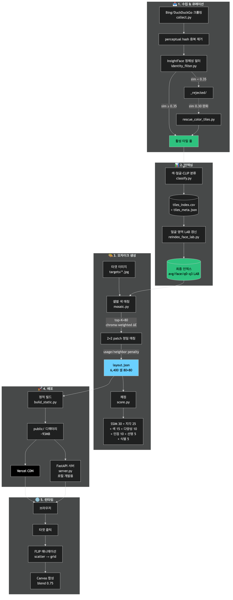

# 유병재 리즈시절 이벤트 참가용 — 인터랙티브 포토 모자이크

코미디언 유병재의 사진 3,500여 장을 타일로 사용해 그의 다른 사진을 재구성하는 웹 기반 인터랙티브 포토 모자이크.

상단의 타겟 후보를 클릭하면 타일들이 **FLIP 애니메이션**으로 재배치되며 타겟 이미지를 형성합니다. 줌인하면 각 타일이 유병재의 또 다른 사진임을 확인할 수 있습니다.

> **🌐 데모**: [yoo-byeongjae-draw.vercel.app](https://yoo-byeongjae-draw.vercel.app)
>
> **현재 점수**: 23장 타겟 평균 **93.40 / 100 (A 등급)**, 모든 타겟 A 등급

## ✨ 주요 기능

- **InsightFace 정체성 필터** — 유병재가 주피사체인 사진만 자동 선별
- **LAB 색공간 매칭** — 2×2 patch + chroma-weighted ΔE로 색 정확도 극대화
- **FLIP 애니메이션** — 같은 타일 풀이 클릭마다 다른 타겟으로 재배치
- **인터랙티브 줌/팬** — Ctrl+휠, 핀치, 드래그로 타일 디테일 확인
- **정적 배포** — Vercel 호환 (FastAPI 서버는 로컬 개발용)

## 🛠 기술 스택

| 영역 | 사용 기술 |
|---|---|
| 백엔드 / 파이프라인 | Python 3.14, FastAPI, OpenCV, NumPy |
| 컴퓨터 비전 | InsightFace (정체성), open_clip (의미 분류), imagehash (중복 제거) |
| 크롤링 | icrawler (Bing/DuckDuckGo) |
| 프론트엔드 | Vanilla JS, Canvas 2D, Web Animations API (FLIP) |
| 패키지 관리 | uv |
| 배포 | Vercel (정적 사이트) |

## 🏗 파이프라인

<p align="center">
  
</p>

> 5단계 흐름: **수집 → 인덱싱 → 모자이크 생성 → 배포 → 런타임**.
> 다이어그램 소스: [`docs/pipeline.mmd`](./docs/pipeline.mmd) (Mermaid).
> 재생성: `npx -y -p @mermaid-js/mermaid-cli mmdc -i docs/pipeline.mmd -o docs/pipeline.png -t dark -b transparent -w 1600`

## 🚀 빠른 시작

### 사전 요구사항

- Python 3.14 이상
- [uv](https://github.com/astral-sh/uv) 패키지 매니저
- macOS / Linux (CPU 기반, GPU 불필요)

### 설치 & 실행

```bash
# 1. 가상환경 + 의존성
uv venv
uv sync

# 2. 타일 수집 (스모크 테스트, 100장)
uv run python src/collect.py --target 100

# 3. 정체성 필터 (reference 빌드 후)
uv run python src/identity_filter.py --build-ref targets/curated_*.jpg
uv run python src/identity_filter.py

# 4. 분류 + 인덱싱
uv run python src/classify.py
uv run python src/reindex_face_lab.py

# 5. 모자이크 생성 (모든 타겟 일괄)
for t in targets/curated_*.jpg; do
  uv run python src/mosaic.py --target "$t"
  layout=$(ls -t output/mosaic_$(basename "$t" .jpg)_*_80x80_layout.json | head -1)
  uv run python src/score.py --layout "$layout" --target "$t"
done

# 6. 로컬 서버
uv run python src/server.py --port 8000
# → http://localhost:8000
```

### 한 줄 명령

```bash
# 23장 전부 재생성
bash scripts/regenerate_all_targets.sh
```

## 🎯 채점 루브릭 (100점)

| 항목 | 가중치 | 측정 |
|---|---|---|
| 구조 유사도 (SSIM) | 30 | 1024×1024 렌더 vs 타겟 |
| 지각 유사도 | 25 | CLIP 임베딩 코사인 |
| 색상 충실도 | 15 | LAB ΔE (셀별 평균) |
| 타일 다양성 | 10 | unique tiles / total cells |
| 인접 중복 회피 | 10 | 좌/위 셀과 동일 타일 비율 |
| 타일 선명도 | 5 | Laplacian variance |
| 확대 식별성 | 5 | 해상도 분포 |

**등급**: A(85+) / B(70+) / C(55+) / D(<55)

### 현재 성과

```
23장 평균  93.40  (A)
최고       96.54  (selfie2_05)
최저       89.46  (handsome_03)
A 등급     23 / 23  (전부)
B 등급     0
```

## 📐 핵심 파라미터

| 파라미터 | 값 | 비고 |
|---|---|---|
| 격자 | **80×80** | 6,400셀, 풀 3,520 기준 sweet spot |
| 블렌딩 | **0.75** | target 75% + tile 25% |
| usage_penalty | 5.0 | 동일 타일 재사용 분산 |
| neighbor_penalty | 2.0 | 인접 동일 타일 회피 |
| color_top_k | 80 | 1차 색 후보군 크기 |
| ab_weight | 3.0 | LAB의 a/b 채널 가중치 |

## 📝 라이선스

유병재 리즈시절 이벤트용 개인 프로젝트, 비상업 용도. 타일/타겟 이미지의 저작권은 원저작자에게 있습니다.

## 🙋 기여

자세한 설계 문서는 [`CLAUDE.md`](./CLAUDE.md) 참조.
